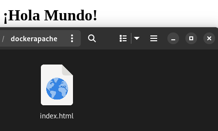
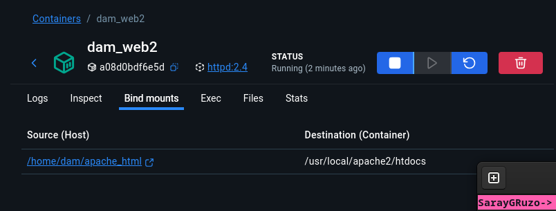
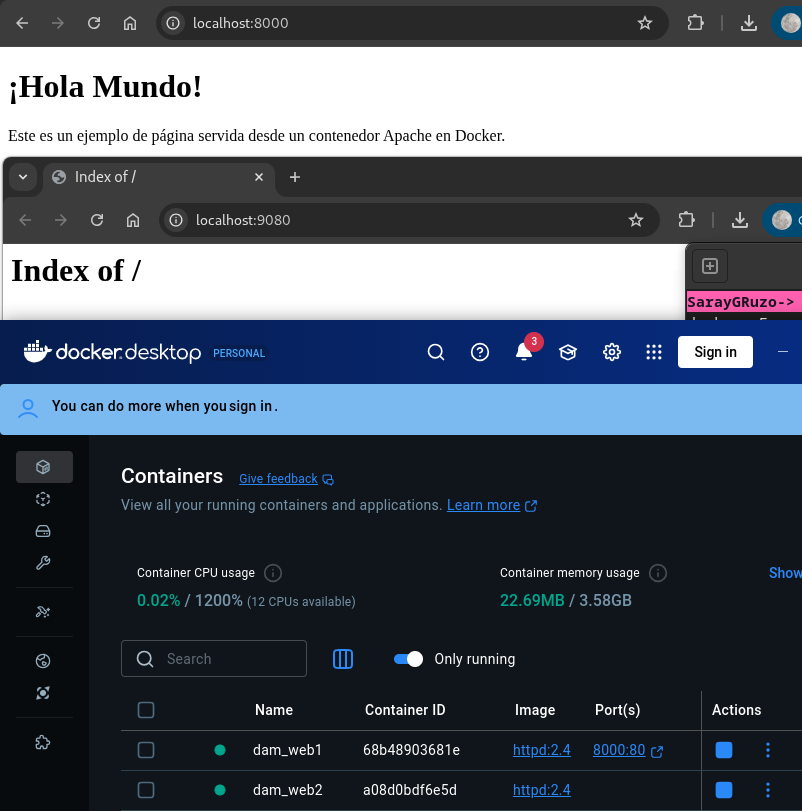
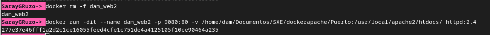
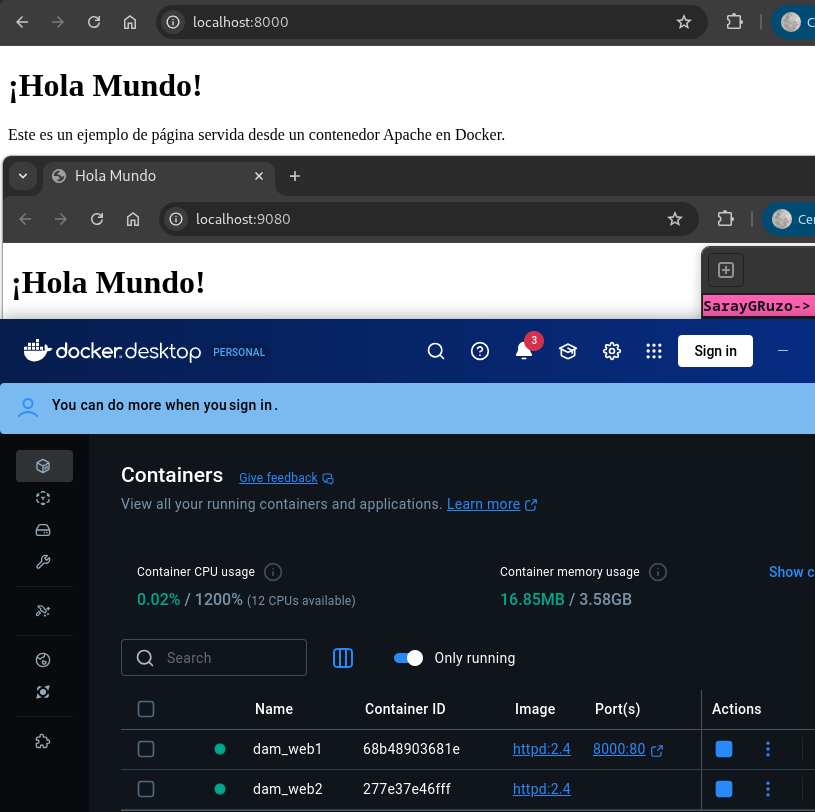

# Práctica Docker — Apache httpd

## 1) Descargar la imagen 'httpd' y comprobar que está en tu equipo

* `docker pull httpd:2.4` descarga la imagen httpd versión 2.4
* `docker images` lista las imágenes locales; ahí debe aparecer `httpd` con tag `2.4` en la lista.

---

## 2) Crear un contenedor con el nombre 'dam_web1'

* `docker run -dit --name dam_web1 httpd:2.4` crea y ejecuta un contenedor con nombre `dam_web1`.
* `docker ps` comprueba que el contenedor está en ejecución.

---

## 3) Si quieres poder acceder desde el navegador de tu equipo, ¿qué debes hacer?

* Primero elimino el contenedor anterior: `docker rm -f dam_web1`
* Luego creo uno nuevo con mapeo de puertos: `docker run -dit --name dam_web1 -p 8000:80 httpd:2.4`
* Verifico con `docker ps` que aparece el mapeo `0.0.0.0:8000->80/tcp`
* Accedo a `http://localhost:8000` en el navegador y compruebo que aparece "It works!"

---

## 4) Utiliza bind mount para que el directorio del apache2 'htdocs' esté montado en un directorio que tu elijas

* Elimino el contenedor anterior: `docker rm -f dam_web1`
* Creo uno nuevo con bind mount: `docker run -dit --name dam_web1 -p 8000:80 -v /home/dam/Documents/5XE/dockerapache:/usr/local/apache2/htdocs httpd:2.4`
* Verifico en Docker Desktop que el bind mount está correctamente configurado, mostrando:
    - Host: `/home/dam/Documents/5XE/dockerapache`
    - Contenedor: `/usr/local/apache2/htdocs`

---

## 5) Realiza un 'hola mundo' en html y comprueba que accedes desde el navegador

* Creo un archivo `index.html` en el directorio (`/home/dam/Documents/5XE/dockerapache`) con contenido "¡Hola Mundo!"
* Accedo a `http://localhost:8000` en el navegador y compruebo que se muestra el contenido del archivo HTML.

---

## 6) Crea otro contenedor 'dam_web2' con el mismo bind mount y a otro puerto

* `docker run -dit --name dam_web2 -p 9080:80 -v /home/dam/Documents/5XE/dockerapache:/usr/local/apache2/htdocs httpd:2.4`
* Verifico con `docker ps` que el contenedor está ejecutándose con el mapeo de puertos `0.0.0.0:9080->80/tcp`

---

## 7) Comprueba que los dos servidores 'sirven' la misma página

* Accedo a ambos URLs en el navegador:
    - `http://localhost:8000`
    - `http://localhost:9080`

---

## 8) Realiza modificaciones de la página y comprueba que los dos servidores 'sirven' la misma página

* Modifico el archivo `index.html` en el último directorio.
* Actualizo ambos URLs en el navegador:
    - `http://localhost:8000`
    - `http://localhost:9080`
* Compruebo que ambos servidores se han actualizado correctamente.

