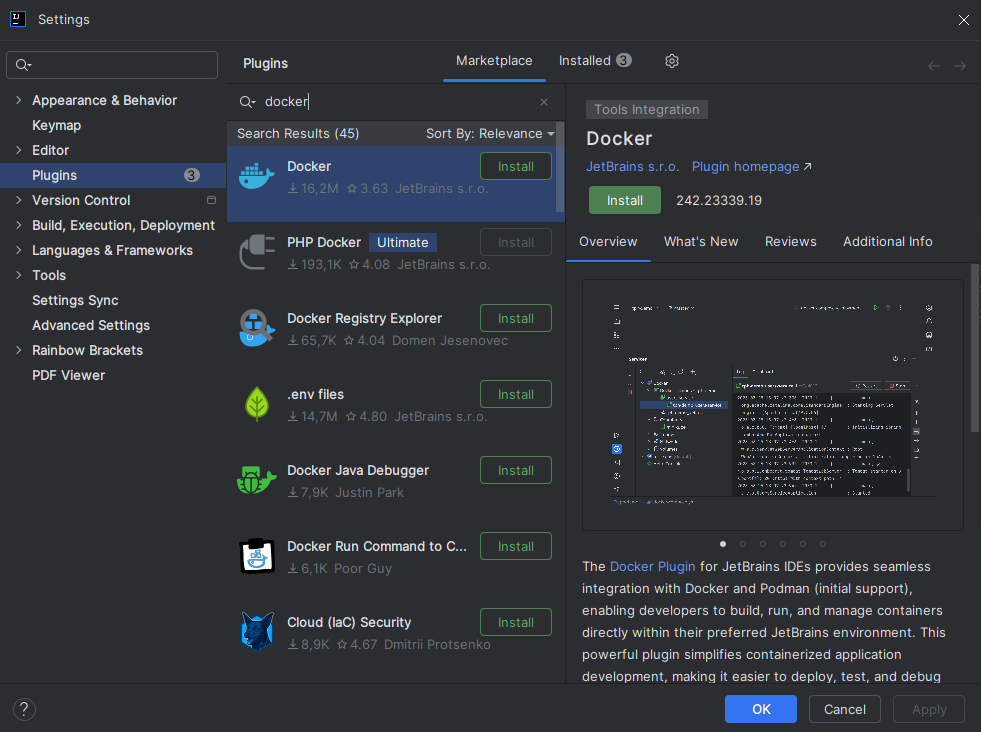

# Entorno de Desarrollo Odoo 18 con Docker, VS Code y PgAdmin

## 1. Preparar el IDE (IntelliJ IDEA

### Extensiones a descargar
Es necesario instalar el plugin de Docker para la gestión de contenedores.


## 2. Instalar Odoo 18 y PgAdmin con Docker Compose

### Crear el archivo `docker-compose.yml`
Crea un archivo llamado `docker-compose.yml` en tu proyecto con el siguiente contenido:

```yaml
services:
  db:
    image: postgres:17
    container_name: odoo-db
    environment:
      POSTGRES_DB: postgres
      POSTGRES_USER: odoo_user
      POSTGRES_PASSWORD: odoo
    volumes:
      - db-data:/var/lib/postgresql/data
    networks:
      - odoo-net

  web:
    image: odoo:18
    container_name: odoo-web
    depends_on:
      - db
    ports:
      - "8069:8069"
    environment:
      - DB_HOST=db
      - DB_PORT=5432
      - DB_USER=odoo_user
      - DB_PASSWORD=odoo
      - DB_NAME=postgres
    volumes:
      - odoo-data:/var/lib/odoo
    networks:
      - odoo-net

  pgadmin:
    image: dpage/pgadmin4:7
    container_name: pgadmin
    environment:
      PGADMIN_DEFAULT_EMAIL: admin@local.com
      PGADMIN_DEFAULT_PASSWORD: admin
    ports:
      - "8080:80"
    volumes:
      - pgadmin-data:/var/lib/pgadmin
    networks:
      - odoo-net

volumes:
  db-data:
  odoo-data:
  pgadmin-data:

networks:
  odoo-net:
    driver: bridge
```

### Ejecutar los contenedores
Asegúrate de tener activo Docker Desktop.
Abre la terminal del IDE y mantente en la ubicación donde guardaste el `docker-compose.yml` y ejecuta:

```bash
docker-compose up
```

Esto levantará los contenedores de Odoo, PostgreSQL y PgAdmin.

### Verificar que Odoo está funcionando
Abre tu navegador y ve a `http://localhost:8069`. Deberías ver la pantalla de creación de base de datos de Odoo.


### Verificar que PgAdmin está funcionando
Ve a `http://localhost:8080` e inicia sesión con:
- Email: `admin@local.com`
- Contraseña: `admin`

**Captura de pantalla:** Me olvidé de sacar la captura del login de PgAdmin.


## 3. Explorar Odoo con Datos de Demo

### Crear una base de datos en Odoo con datos de demostración
En la pantalla de Odoo (`http://localhost:8069`):

1. Rellena los campos:
    - **Database Name:** `odoo_demo` (o el nombre que prefieras)
    - **Email:** tu email (por ejemplo, `admin@local.com`)
    - **Password:** una contraseña (por ejemplo, `admin`)
    - **Phone:** opcional
    - **Language:** elige el idioma
    - **Country:** elige el país
    - **Demo Data:** marca la casilla para cargar datos de demostración.

2. Haz clic en "Create database".


### Instalar módulos básicos
Una vez dentro de Odoo, ve a la aplicación "Apps" y busca e instala los módulos de:
- Ventas
- Compras
- Contactos


## 4. Inspeccionar la base de datos con PgAdmin

### Conectar PgAdmin a la base de datos de Odoo
En PgAdmin (`http://localhost:8080`):

1. Haz clic en "Add New Server".
2. En la pestaña "General", pon un nombre, por ejemplo `Odoo DB`.
3. En la pestaña "Connection":
    - **Host name/address:** `db` (el nombre del contenedor de la base de datos)
    - **Port:** `5432`
    - **Maintenance database:** `postgres`
    - **Username:** `odoo_user`
    - **Password:** `odoo` (la contraseña que pusiste en el docker-compose para la base de datos)

4. Haz clic en "Save".
