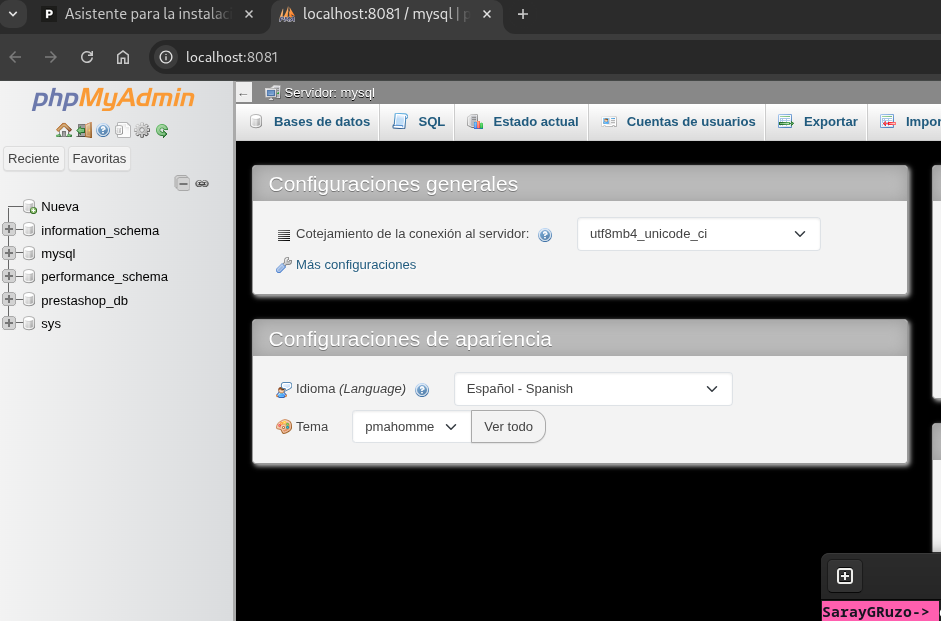

# Tarea Docker Compose PrestaShop

## Nivel 1:

### 1) Crear el archivo `docker-compose.yml`
```yaml
    server:
      image: mysql:latest
      container_name: mysql_db
      restart: always
      environment:
        MYSQL_ROOT_PASSWORD: admin123
        MYSQL_DATABASE: prestashop_db
        MYSQL_USER: prestashop_user
        MYSQL_PASSWORD: prestashop_pass
      networks:
        - prestashop_network
    
    prestashop:
      image: prestashop/prestashop:latest
      container_name: prestashop
      restart: always
      depends_on:
        - db
      ports:
      - "8080:80"
      environment:
        DB_SERVER: db
        DB_NAME: prestashop_db
        DB_USER: prestashop_user
        DB_PASSWD: prestashop_pass
      networks:
        - prestashop_network
    
    phpmyadmin:
      image: phpmyadmin/phpmyadmin:latest
      container_name: phpmyadmin
      restart: always
      depends_on:
        - db
      ports:
        - "8081:80"
      environment:
        PMA_HOST: db
        PMA_USER: root
        PMA_PASSWORD: admin123
      networks:
        - prestashop_network
    
  networks:
  prestashop_network:
```

* Se crea un archivo `docker-compose.yml` que define los tres servicios.
* Se configuran las dependencias con `depends_on` y las variables de entorno necesarias para las conexiones.
* Las contraseñas y configuraciones se escriben directamente en el archivo.

### 2) Ejecutar el .yml

* Ejecutamos `docker compose up -d` para levantar los servicios en segundo plano.


### 3) Comprobar que PrestaShop está funcionando

* Accedemos a `http://localhost:8080` y vemos el asistente de instalación de PrestaShop.


### 4) Comprobar que phpMyAdmin muestra las tablas de la base de datos de PrestaShop

* Accedemos a `http://localhost:8081`.
* Comprobamos que se muestran las tablas de la base de datos `prestashop_db` en la parte izquierda de la pantalla.

* 
---

## Nivel 2: Seguridad y persistencia

* Creamos un archivo `.env` en el mismo directorio que `docker-compose.yml`.
* Movemos todas las contraseñas y configuraciones del `.yml` a este archivo.
* El archivo `.env` contiene:
    - Base de Datos:
      - MYSQL_ROOT_PASSWORD: Contraseña del usuario root de MySQL
      - MYSQL_DATABASE: Nombre de la base de datos que se creará automáticamente
      - MYSQL_USER y MYSQL_PASSWORD: Usuario y contraseña para PrestaShop

    - PrestaShop:
      - PS_INSTALL_AUTO=1: Habilita la instalación automática sin asistente
      - PS_LANGUAGE=es y PS_COUNTRY=ES: Configuran español como idioma por defecto
      - ADMIN_MAIL y ADMIN_PASSWD: Credenciales del administrador de PrestaShop
    - phpMyAdmin:
      - PMA_HOST=db: Conecta phpMyAdmin al servicio de base de datos
      - PMA_USER=root: Usuario para acceder a phpMyAdmin
      
* Reemplazamos variables por `${NOMBRE_VARIABLE}` en el `.yml`.

```yaml
    # CONFIGURACIÓN BASE DE DATOS
    MYSQL_ROOT_PASSWORD=admin123
    MYSQL_DATABASE=prestashop_db
    MYSQL_USER=prestashop_user
    MYSQL_PASSWORD=prestashop_pass
    
    # CONFIGURACIÓN PRESTASHOP
    DB_SERVER=db
    DB_NAME=prestashop_db
    DB_USER=prestashop_user
    DB_PASSWD=prestashop_pass
    PS_INSTALL_AUTO=1
    PS_DOMAIN=localhost:8080
    PS_LANGUAGE=es
    PS_COUNTRY=ES
    ADMIN_MAIL=admin@ejemplo.com
    ADMIN_PASSWD=Admin123!
    
    # CONFIGURACIÓN PHPMyAdmin
    PMA_HOST=db
    PMA_USER=root
    PMA_PASSWORD=admin123
```

### 2) Añadir volúmenes para persistencia

* Definimos volúmenes en la sección `volumes` del `docker-compose.yml`:
    - `db_data` para persistir `/var/lib/mysql` (datos de la base de datos)
    - `prestashop_data` para persistir `/var/www/html` (archivos de PrestaShop)
* Montamos los volúmenes en cada servicio.
* Los datos ahora sobreviven incluso si los contenedores se eliminan.

---

## Nivel 3: Healthchecks y dependencias

### 1) Añadir healthcheck.

* * Agregamos `healthcheck` al servicio `db` que verifica que MySQL esté operativo.
* Configuramos:
    - `interval: 10s` - verifica cada 10 segundos
    - `timeout: 5s` - tiempo máximo de espera
    - `retries: 5` - número de reintentos
    - `start_period: 30s` - tiempo de gracia al iniciar

### 2) Modificar `depends_on` para esperar por el healthcheck.

* En los servicios `prestashop` y `phpmyadmin`, cambiamos la dependencia:
    - De: `depends_on: - db`
    - A: `depends_on: db: condition: service_healthy`
* Esto asegura que PrestaShop y phpMyAdmin esperen hasta que MySQL pueda usarse con seguridad.

```yaml
services:
  db:
    image: mysql:latest
    container_name: mysql_db
    restart: always
    environment:
      MYSQL_ROOT_PASSWORD: ${MYSQL_ROOT_PASSWORD}
      MYSQL_DATABASE: ${MYSQL_DATABASE}
      MYSQL_USER: ${MYSQL_USER}
      MYSQL_PASSWORD: ${MYSQL_PASSWORD}
    volumes:
      - db_data:/var/lib/mysql #Nivel 2
    networks:
      - prestashop_network
    healthcheck: #Nivel 3
      test: ["CMD", "mysqladmin", "ping", "-h", "localhost"]
      interval: 10s
      timeout: 5s
      retries: 5
      start_period: 30s

  prestashop:
    image: prestashop/prestashop:latest
    container_name: prestashop
    restart: always
    depends_on:
      db:
        condition: service_healthy #Nivel 3
    ports:
      - "8080:80"
    environment:
      DB_SERVER: ${DB_SERVER}
      DB_NAME: ${DB_NAME}
      DB_USER: ${DB_USER}
      DB_PASSWD: ${DB_PASSWD}
      PS_INSTALL_AUTO: ${PS_INSTALL_AUTO}
      PS_DOMAIN: ${PS_DOMAIN}
      PS_LANGUAGE: ${PS_LANGUAGE}
      PS_COUNTRY: ${PS_COUNTRY}
      ADMIN_MAIL: ${ADMIN_MAIL}
      ADMIN_PASSWD: ${ADMIN_PASSWD}
    volumes:
      - prestashop_data:/var/www/html #Nivel 2
    networks:
      - prestashop_network

  phpmyadmin:
    image: phpmyadmin/phpmyadmin:latest
    container_name: phpmyadmin
    restart: always
    depends_on:
      db:
        condition: service_healthy #Nivel 3
    ports:
      - "8081:80"
    environment:
      PMA_HOST: ${PMA_HOST}
      PMA_USER: ${PMA_USER}
      PMA_PASSWORD: ${PMA_PASSWORD}
    networks:
      - prestashop_network

volumes:
  db_data:
  prestashop_data:

networks:
  prestashop_network:
```
* Ejecutamos `docker compose up` para levantar los servicios con las nuevas configuraciones. 
  (Anteriormente debemos eliminar el contenedor ya creado con `docker compose down -v`).


---

## Comprobación de la instalación automatica y el funcionamiento de ambos puertos.


