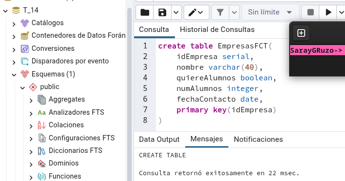
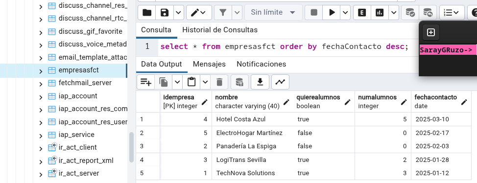
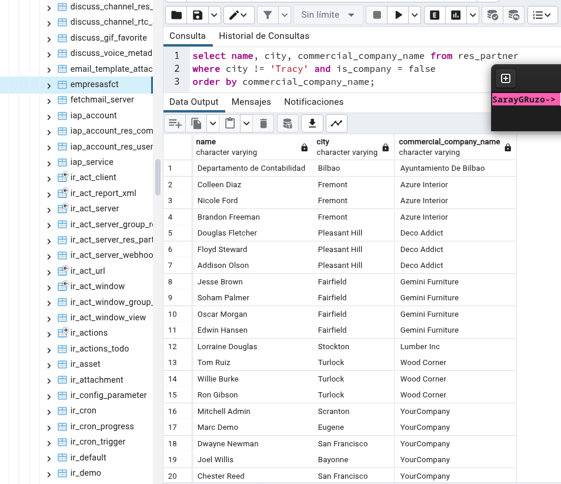
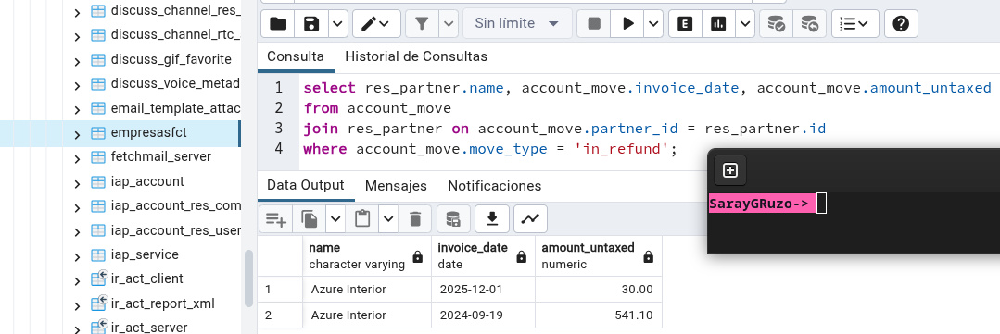
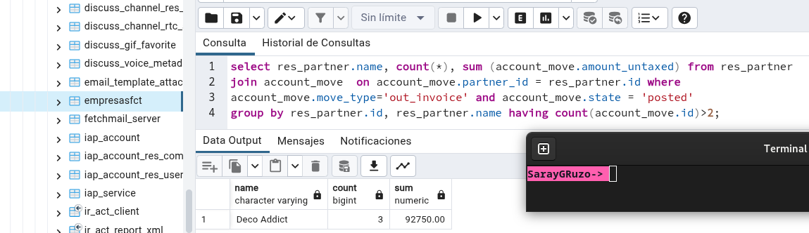
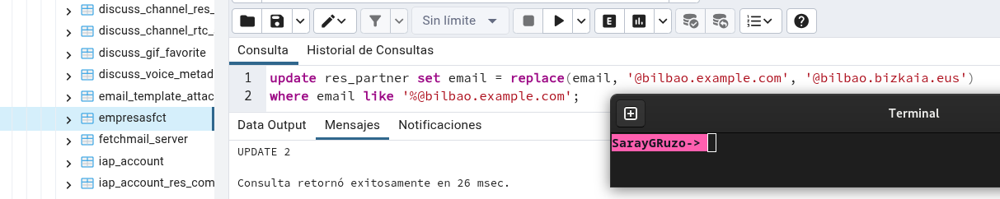

# Tarea_14

## 1. Conectar con PgAdmin y Odoo

## 2. Crear tabla en PgAdmin `EmpresasFCT`

```sql
CREATE TABLE EmpresasFCT(
    idEmpresa SERIAL PRIMARY KEY,
    nombre VARCHAR(40),
    quiereAlumnos BOOLEAN,
    numAlumnos INTEGER,
    fechaContacto DATE
);
```



### 3. Inserción de datos

```sql
INSERT INTO empresasfct (nombre, quiereAlumnos, numAlumnos, fechaContacto) VALUES
('TechNova Solutions', TRUE, 3, '2025-01-12'),
('Panadería La Espiga', FALSE, 0, '2025-02-03'),
('LogiTrans Sevilla', TRUE, 2, '2025-01-28'),
('Hotel Costa Azul', TRUE, 5, '2025-03-10'),
('ElectroHogar Martínez', FALSE, 0, '2025-02-17');
```


### 4. Consulta ordenada por fecha
```sql
SELECT * FROM empresasfct ORDER BY fechaContacto DESC;
```



### 5. Listado de contactos, no empresas

```sql
SELECT name, city, commercial_company_name
FROM res_partner
WHERE city != 'Tracy' AND is_company = FALSE
ORDER BY commercial_company_name;
```


### 6. Empresas proveedoras con reembolsos

```sql
SELECT res_partner.name, account_move.invoice_date, account_move.amount_untaxed
FROM account_move
JOIN res_partner ON account_move.partner_id = res_partner.id
WHERE account_move.move_type = 'in_refund';
```


### 7. Empresas clientes con más de 2 facturas confirmadas

```sql
SELECT res_partner.name, COUNT(*), SUM(account_move.amount_untaxed)
FROM res_partner
JOIN account_move ON account_move.partner_id = res_partner.id
WHERE account_move.move_type = 'out_invoice' AND account_move.state = 'posted'
GROUP BY res_partner.id, res_partner.name
HAVING COUNT(account_move.id) > 2;
```


### 8. Actualización de dominios de correo
```sql
UPDATE res_partner
SET email = REPLACE(email, '@bilbao.example.com', '@bilbao.bizkaia.eus')
WHERE email LIKE '%@bilbao.example.com';
```

