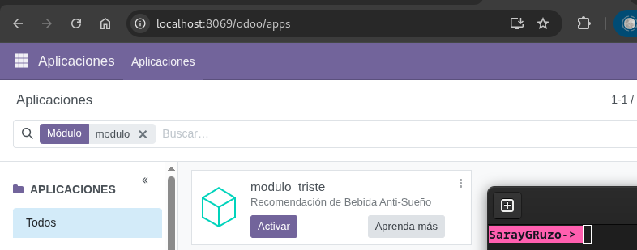
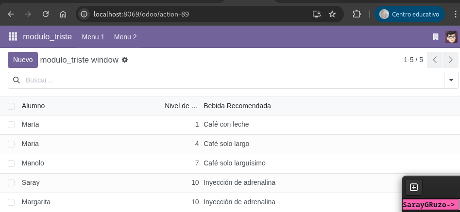
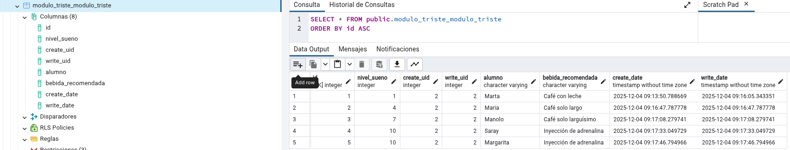

# Recomendación de Bebida Anti-Sueño

## Servicios y Credenciales

### 1. Base de Datos (PostgreSQL 17)
- **Contenedor:** T15_db
- **Volumen:** db-data
- **Credenciales:**
  - Usuario: odoo
  - Contraseña: odoo
  - Base de datos: postgres

### 2. Odoo 18
- **Contenedor:** T15_odoo
- **URL de acceso:** http://localhost:8069
- **Credenciales de base de datos:**
  - Host: db
  - Usuario: odoo_user
  - Contraseña: odoo_pass
  - Nombre de base de datos: odoo_db
- **Contraseña de administrador:** Admin

### 3. pgAdmin 4
- **Contenedor:** T15_pgadmin
- **URL de acceso:** http://localhost:8080
- **Credenciales:**
  - Email: admin@local.com
  - Contraseña: admin

## Funcionalidades
- Registro de alumnos y su nivel de sueño (1-10)
- Cálculo automático de bebida recomendada según reglas predefinidas
- Interfaz de usuario con menú, vista de lista y formulario
- Datos persistentes en base de datos

### 1. Acceder al módulo
- Navegar a la aplicación principal de Odoo
- Buscar el menú "modulo_triste" en la barra de navegación superior

### 2. Registrar alumno
1. Hacer clic en "Nuevo"
2. Completar los campos:
   - **Alumno**: Nombre del estudiante
   - **Nivel de Sueño**: Valor entre 1 y 10
3. El campo "Bebida Recomendada" se calculará automáticamente

### 3. Comprobar registros

### 4. Comprobar registros en PgAdmin
