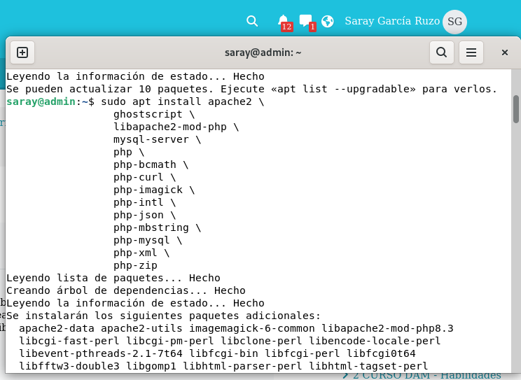

# Guía de Instalación Manual de WordPress en Ubuntu 24.04

## Análisis del Proceso

Insta
lación manual de WordPress en un servidor Ubuntu 24.04 utilizando Apache, MySQL y PHP (stack LAMP).

## Comandos Ejecutados y su Propósito

### 1. Actualización del Sistema
```bash
sudo apt update
```
Para actualizar la lista de paquetes disponibles en los repositorios.


### 2. Instalación de Dependencias
```
sudo apt install apache2 \
    ghostscript \
    libapache2-mod-php \
    mysql-server \
    php \
    php-bcmath \
    php-curl \
    php-imagick \
    php-intl \
    php-json \
    php-mbstring \
    php-mysql \
    php-xml \
    php-zip
```
Para instalar todos los componentes necesarios para WordPress:
- **Apache2**: Servidor web
- **MySQL**: Base de datos
- **PHP** y extensiones: Motor de procesamiento de WordPress
- **Ghostscript**: Manipulación de documentos

### 3. Configuración del Directorio Web y Descarga e instalación de WordPress
```bash
sudo mkdir -p /srv/www
sudo chown www-data: /srv/www
```
Para crear y asignar permisos al directorio donde residirá WordPress.

```bash
curl https://wordpress.org/latest.tar.gz | sudo -u www-data tar zx -C /srv/www
```
Para descargar y extraer la última versión de WordPress manteniendo los permisos correctos.

### 4. Configuración de Apache
```bash
sudo nano /etc/apache2/sites-available/wordpress.conf
sudo a2ensite wordpress
sudo a2enmod rewrite
sudo a2dissite 000-default
sudo service apache2 reload
```
Con lo anterior logramos:
- Crear configuración virtual host para WordPress
- Habilitar el sitio WordPress
- Activar módulo rewrite para URLs amigables
- Deshabilitar sitio por defecto
- Recargar configuración de Apache

### 5. Configuración de la Base de Datos
```bash
sudo mysql -u root
```
Dentro de MySQL:
```sql
CREATE DATABASE wordpress;
CREATE USER wordpress@localhost IDENTIFIED BY 'admin';
GRANT SELECT,INSERT,UPDATE,DELETE,CREATE,DROP,ALTER ON wordpress.* TO wordpress@localhost;
FLUSH PRIVILEGES;
quit
```
Para crear base de datos, usuario y permisos necesarios para WordPress.


### 6. Configuración de WordPress

#### a. Copiar archivo de configuración
```bash
sudo -u www-data cp /srv/www/wordpress/wp-config-sample.php /srv/www/wordpress/wp-config.php
```

#### b. Configurar credenciales de base de datos
```bash
sudo -u www-data sed -i 's/database_name_here/wordpress/' /srv/www/wordpress/wp-config.php
sudo -u www-data sed -i 's/username_here/wordpress/' /srv/www/wordpress/wp-config.php
sudo -u www-data sed -i 's/password_here/admin/' /srv/www/wordpress/wp-config.php
```

#### c. Configurar claves de seguridad (SALT)
**Paso CRÍTICO para la seguridad:**

1. **Eliminar las líneas de claves por defecto** en el archivo `wp-config.php`
2. **Obtener claves seguras** desde la API de WordPress:
```bash
curl -s https://api.wordpress.org/secret-key/1.1/salt/
```
3. **Copiar y pegar** el contenido generado en el archivo `wp-config.php` donde estaban las claves originales

#### d. Editar el archivo de configuración
```bash
sudo -u www-data nano /srv/www/wordpress/wp-config.php
```

### 7. Entrar en WordPress

#### a. Abre el asistente de instalación
Entra desde el navegador en: http://localhost/


#### b. Inicia sesión en WordPress
Entra en la página de login:
http://localhost/wp-login.php


#### c. Iniciar sesión en WordPress
Una vez completada la instalación, accede al panel de administración:
```
http://localhost/wp-login.php
```


### 8. Buscar y Activar un Tema en WordPress

#### Desde el Panel de Administración:
1. **Ir a** → `Apariencia` → `Temas`
2. **Buscar temas** 
4. **Previsualizar** el tema antes de instalar
5. **Instalar** y **Activar** el tema elegido


### 9. Buscar, Instalar y Activar Plugins en WordPress

#### Desde el Panel de Administración:
1. **Ir a** → `Plugins`
2. **Buscar** plugins 
3. **Instalar** el plugin escogido (En este caso Gutenberg)
4. **Activar** el plugin después de la instalación
